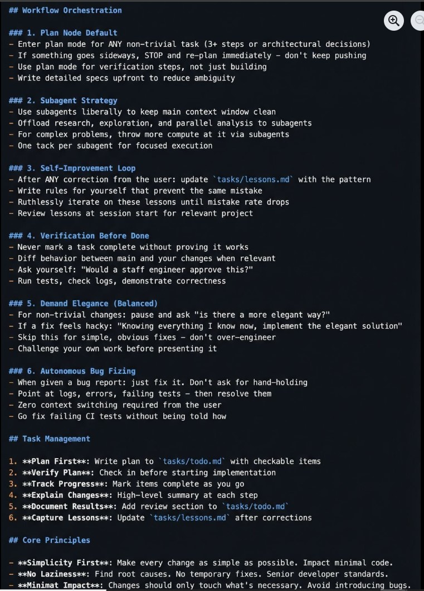

This 𝗖𝗟𝗔𝗨𝗗𝗘.𝗺𝗱 file will make you 10x engineer 👇

It combines all the best practices shared by Claude Code creator:

Boris Cherny (creator of Claude Code at Anthropic) shared on X internal best practices and workflows he and his team actually use with Claude Code daily. Someone turned those threads into a structured 𝗖𝗟𝗔𝗨𝗗𝗘.𝗺𝗱 you can drop into any project.

## It includes:

- •  Workflow orchestration
- •  Subagent strategy
•  Self-improvement loop
•  Verification before done
•  Autonomous bug fixing
•  Core principles

This is a compounding system. Every correction you make gets captured as a rule. Over time, Claude's mistake rate drops because it learns from your feedback.

If you build with AI daily, this will save you a lot of time

# Source:### [Link](https://www.facebook.com/share/p/18MSCvXGR4/)

